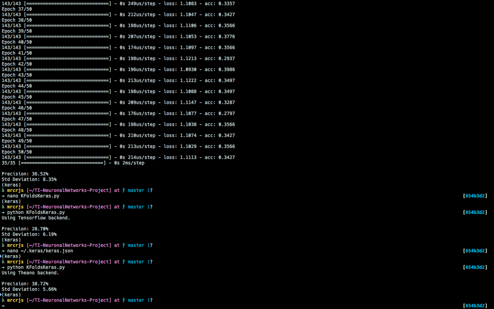

Keras Example
=======



Example for the creation of a KFolds cross-validation neural network with Keras / sklearn.

## Requirements
- Python 3
- Dataset with the following structure:

```
Total of elements in the dataset
Number of attributes
Number of classes
attribute1, attribute2, ..., attribute n, class
...
attribute1, attribute2, ..., attribute n, class

```

You can find datasets examples in /input.

## Usage

`$ python KFoldsKeras.py`

## Tunning

You can experiment by changing the following variables

[NFOLDS](https://github.com/MrcRjs/Keras-Example/blob/master/KFoldsKeras.py#L34)

[MOMENTUM](https://github.com/MrcRjs/Keras-Example/blob/master/KFoldsKeras.py#L35)

[LEARNING_RATE](https://github.com/MrcRjs/Keras-Example/blob/master/KFoldsKeras.py#L36)

[EPOCHS](https://github.com/MrcRjs/Keras-Example/blob/master/KFoldsKeras.py#L37)

[BATCH](https://github.com/MrcRjs/Keras-Example/blob/master/KFoldsKeras.py#L38)

You can also modify the [configurations](https://github.com/MrcRjs/Keras-Example/blob/master/KFoldsKeras.py#L65-L75) of the layers of the neural network, add more layers, activation functions, number of nodes, etc.

If you want to learn more about neural networks I highly recommend you [this course](https://www.udacity.com/course/ud730).
